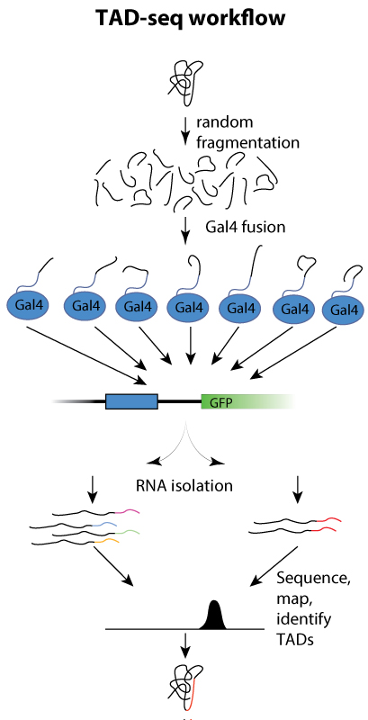
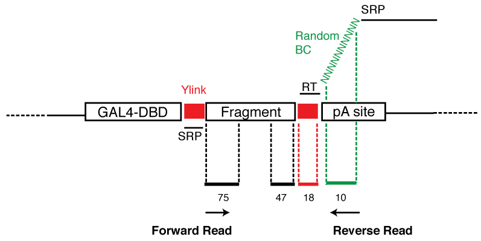

# TAD-seq

We are of course interested in the same basic question: 
How do cells that have the same underlying genomic sequence give rise to such different cell types throughout development to give rise to such complex organisms? 
This is possible because of cell-type specific gene expression.

While many of our projects focus on the identification of what sequences can act as enhancer sequences, TAD-seq focuses on the proteins that bind these regulatory 
sequences and can by the recruitment of cofactors cab active transcription. The recruitment of cofactors is done via the transcriptional activation domains of
transcription factors. TADs are highly unstructured, and are sufficient and necessary to trans-activate transcription. However, not many TADs are known because
they do not bind the DNA.

Therefore we developed a new approach called TADseq in which randomly sonicated TF CDS DNA and fuse the fragments to Gal4-DBD, transfect it into a reporter cell
line, followed by FACS sorting to enrich for TAD sequences in the GFP positive sample. Isolate mRNA followed by deep sequencing and comparing the fragments of the GFP
positive to the GFP negative samples which leads to an enrichment of a TAD. This allows us to identify all TADs in all TFs in the library in parallel.

	   

## Plasmid Fragment GAL4-Fusion Construct

Downstream the promoter, you have a GAL4 DNA binding domain, followed by a Y-linker, the DNA fragment, another Y-linker and polyA site.

The forward read's sequence ready PCR (SRP) binds the Y-linker downstream of the GAL4-DBD. The forward read starts immediately after the first Y-linker at the first
position of the fragment and sequences towards the interior of the fragment. The reverse transcription (RT) primer binds the second Y-linker that is upstream of the
polyA site. This RT primer is followed by a random barcode, currently 10 nucleotides long, and the sequence ready PCR (SRP). The reverse read starts at the random
barcode, through the Y-linker into the fragment. If the reads are 75nt long, and the Y-linker is 18nt long this would leave 47nt of the read for the fragment.

## 

